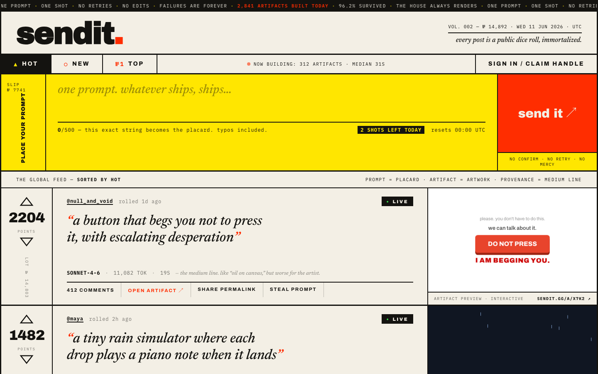

# single take

> **Post the prompt. Link the result. Upvote the best.**

A global feed of AI prompts and what they built. Every post is one prompt
(≤ 300 chars, verbatim — the hero), a link to wherever the result lives, and the
model it was made with. The prompt is the record: **nothing gets edited.** Vote on
the best, comment freely, crosspost from anywhere.

This repo is a runnable implementation styled to the Richard-Turley
auction-catalog mockups in [`design/`](./design). It runs with zero external
services; Google sign-in is the only optional integration.



---

## Quick start

```bash
npm install
npm run db:seed     # seed the feed with sample posts
npm run dev         # http://localhost:3000
```

No database server, no API keys, no cloud accounts required. SQLite is created on
first run; the seed script fills the feed so it isn't empty.

### Sign in

Posting needs an account (reading is always free):

- **Magic link** — enter an email. Locally this is a dev stand-in: no email is
  actually sent, you proceed straight through.
- **Continue with Google** — real OAuth. Copy `.env.example` to `.env` and set
  `GOOGLE_CLIENT_ID` / `GOOGLE_CLIENT_SECRET` from a Google Cloud **Web
  application** OAuth client (register redirect URI
  `http://localhost:3000/api/auth/google/callback`). Without these, the button
  shows a "not configured" notice and magic link still works.

Either path lands a brand-new account on a **pick-your-handle** step (handles are
permanent); returning accounts go straight to the feed.

### Post

In the composer: type the prompt, paste the **result link** (required), pick the
**model** from the dropdown (required). Hit **post it** — it's live instantly. No
confirm, no edits.

---

## The two modes

single take has two modes, switchable from the nav:

- **the feed (this build)** — prompt + result link + model. Free, instant,
  model-agnostic, crosspostable. `status` is `live` | `removed`.
- **verified one-shot (coming soon, `/generate`)** — the credibility layer:
  generate the artifact *here*, no retries, real provenance, a permanent immutable
  artifact hosted on-platform. The dormant `lib/generation/*` pipeline (worker,
  sandboxed artifact server at `/a/[key]`, SSE live-hatch, static safety scan,
  content-addressed store) is preserved in the tree, unwired, ready to light up
  when API credits land. See [`plan.md`](./plan.md) for the full pivot rationale.

---

## Stack

- **Next.js 15** (App Router, React 19) — server components + route handlers.
- **SQLite via better-sqlite3 + Drizzle ORM** (`src/db/schema.ts`). uuid PKs as
  text, timestamps as epoch-ms integers.
- **Signed-cookie auth** (`src/lib/auth.ts`) — own the users table. Magic-link
  (dev stand-in) + hand-rolled **Google OAuth 2.0** (`src/lib/google.ts`, no SDK).
- **Write-time ranking** (`src/lib/ranking.ts`) — Reddit-style `hot_rank` computed
  on every vote; the feed is a pure cursor-paginated index scan.

---

## Project layout

```
src/
  db/            schema.ts · ddl.ts · index.ts (better-sqlite3) · seed.ts
  lib/
    auth.ts google.ts models.ts ranking.ts ids.ts format.ts queries.ts
    generation/  DORMANT (verified one-shot) — worker, generate, stub, scan,
                 store, events, prompt
  app/
    page.tsx                 the feed
    p/[slug]/page.tsx        a post (prompt placard + result preview + comments)
    u/[handle]/page.tsx      a maker's profile
    generate/page.tsx        verified one-shot — coming soon
    about/page.tsx           the rules
    auth/signin/page.tsx     magic link / Google
    auth/handle/page.tsx     pick your permanent handle
    a/[key]/route.ts         DORMANT artifact server (strict CSP)
    api/
      posts · feed · posts/[slug]/{vote,comments} · comments/[id]/vote
      reports · auth/{email,google,google/callback,handle,logout}
    globals.css · pages.css  the Turley design system, ported from design/mockups
  components/                chrome (Ticker/Masthead/Nav/SortTabs/ModeSwitch) ·
                             Composer · LotCard · VoteWidget · CommentSection ·
                             SignInForm · HandleForm · PostActions · LotActions …
```

## Data model

Tables: `users`, `posts`, `votes`, `comments`, `comment_votes`, `reports`
(plus dormant `generation_jobs`). A `posts` row carries the B columns
(`result_url`, `result_image`, `tool`, `verified`) alongside the dormant A
columns (`artifact_key`, `model_id`, tokens, `generation_ms`, …) which stay
unused until the verified lane ships.

## Scripts

| command | what it does |
|---|---|
| `npm run dev` | start the app (auto-creates the SQLite schema on first run) |
| `npm run db:seed` | wipe + reseed the sample feed |
| `npm run build` / `npm start` | production build / serve |
| `npm run db:push` | drizzle-kit push (schema parity check) |

## Notes & scope

- **Reading is free**; posting needs an account. The result link and the model
  are both required on a post.
- **The prompt is permanent** — there is deliberately no edit or delete endpoint
  for the prompt; posts can only be `removed` (tombstoned).
- **Out of scope** (v1): following, DMs, search, the admin moderation UI. Reports
  are captured to the `reports` table.
- **`.env` and `src/db/seed.ts` are gitignored.** The Google OAuth secret lives in
  `.env`; never commit it.
